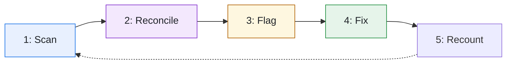
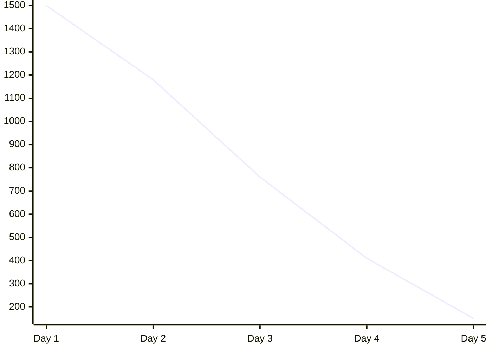
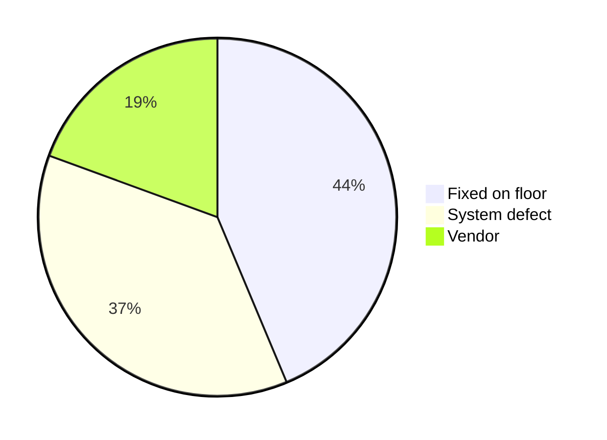
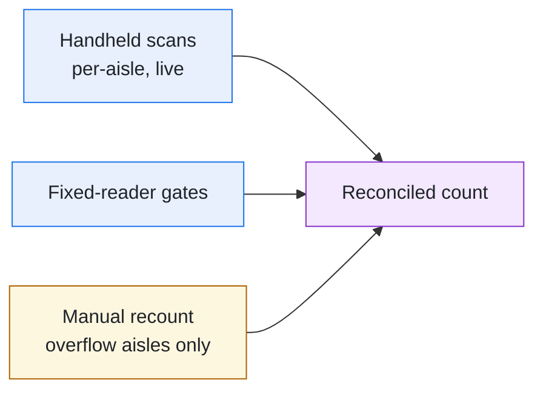

# Q3 Warehouse Inventory Count — Discrepancies & Fixes

Reconciled review of the 10,000-unit cycle count: what didn't match, why, and the fix for each category.

Mixed audience — ops reads the impact, the floor team reads the fix.

- [Overview](#overview)
- [Discrepancies & fixes](#discrepancies--fixes)
- [Count progress](#count-progress)
- [Verification](#verification)
- [Rollout](#rollout)
- [Method](#method)
- [At a glance](#at-a-glance)
- [Appendix — discrepancy-reason raw counts](#appendix--discrepancy-reason-raw-counts)
- [Counts at a glance](#counts-at-a-glance)
- [Count methods compared](#count-methods-compared)
- [Readiness by zone](#readiness-by-zone)
- [Where the count comes from](#where-the-count-comes-from)
- [How to run the recount](#how-to-run-the-recount)
- [Pulling a bin from the WMS yourself](#pulling-a-bin-from-the-wms-yourself)
- [Reconciling a bin against the live system](#reconciling-a-bin-against-the-live-system)
- [Sources](#sources)

* **Source**: WMS export
* **Period**: Q3 2026
* **Site**: DC-West
* **Owner**: Inventory Ops

## Overview

*Reconciled review of the 10,000-unit Q3 cycle count.*

- **Count date**: 2026-07-09 14:22 UTC
- **Units expected**: 10,000
- **Method**: `full cycle count`
- **Mode**: strict

* **Matched cleanly**: 8,500 (85.0%) **▲ +3%**
* **Floor — fixable**: 1,100 (11.0%) **Floor**

  Miscounts + mislabeled bins we can correct.
* **Vendor — escalate**: 400 (4.0%) **▼ −90** **Vendor**
* **Count status**: HEALTHY
* **Total units**: 10,000

- **Matched cleanly**: 85.0%, 8,500 units
- **Floor-fixable**: 11.0%, 1,100
- **Vendor**: 4.0%, 400

The count reconciles exactly: every unit lands in one bucket and the counts sum to the expected total. Reconciliation is a **hard gate** — a page that does not balance *will not build*. The old ~~bin \> 12~~ scan rule is under review; see the [method](https://example.com/runbook).

Percentages are of the 10,000-unit total. Counts were verified against the shelf, not estimated.

Every bin label now ends in a <ins>check digit</ins>. The cold room logged H<sub>2</sub>O condensation on 3 of 10<sup>2</sup> shelves, so its scans run twice; C++ tooling and \~2 days of rescans are out of scope.

Zone C is behind schedule, its recount is due Friday, and the vendor lots stay open until the supplier replies.

### Count pipeline



- **Flag** **System**

### Discrepancy resolution across teams

| Lane | Detect<br>In-house | Investigate | Resolve | Escalate<br>Vendor claim |
| --- | --- | --- | --- | --- |
| **Floor** | ✅ **1** Recount bin | ⏸️ **2b** Re-label |  |  |
| **System** |  | 🔵 **2a** Check scan log | ⚪ **3** Reconcile |  |
| **Vendor** |  |  |  | ⛔ **4** Escalate short-ship |

✅ done · 🔵 current · ⚪ todo · ⛔ blocked · ⏸️ deferred

> ⚠️ **Action needed before the next count**
>
> The `bin > 12` scan rule skipped 260 valid units in overflow aisles. Confirm the rule with the site lead before re-counting.

> 📏 Counts below are per distinct discrepancy class, not per unit.

## Discrepancies & fixes

**Legend: badges used on this page**

- **Floor** Fixable on the floor before the next count.
- **System** Defect in the scanning/labeling pipeline.
- **Vendor** Depends on the vendor to resolve.

| Discrepancy | Risk | Units | What the problem is | Proposed fix |
| --- | --- | --- | --- | --- |
| **Floor — fixable (1,100)** |  |  |  |  |
| Double-counted units **Floor**<br>Skipped, bin \> 12: 260<br>Same-window re-scan: 340 | 🟡 | 600 (6.0% of total) | The same pallet is scanned twice when a picker re-enters an aisle within the count window. | De-duplicate on the pallet ID (`pallet_id`) before totalling; keep the most recent scan. |
| Mislabeled bin codes **System** | 🟡 | 500 (5.0% of total) | Scanner assumed 5-digit bin codes; 9-digit codes were truncated and failed the lookup. | Widen the scanner to accept 9-digit codes; re-scan the 500 truncated bins from the raw log. |
| **Vendor — escalation (400)** |  |  |  |  |
| Short shipment **Vendor** | 🔴 | 400 (4.0% of total) | The vendor's ASN listed 400 units that never arrived on the dock, so they can't be counted. | Escalated to the vendor (ticket `OPS-1234`); hold the line until a corrected ASN arrives. |
| **Correctly counted — no action (0)** |  |  |  |  |
| *none* |  |  |  |  |

**Discrepancies by owner**: **Floor** 1 · **System** 1 · **Vendor** 1

Reconciles: 1,500 + 8,500 matched cleanly = 10,000.

## Count progress

- **Zone A**: ██████████ 100.0%
- **Zone B**: █████████░ 92.0%
- **Zone C**: █████████░ 85.0%
- **Overflow**: ░░░░░░░░░░ 4.0%

| Zone | Counted | Variance | Note |
| --- | --- | --- | --- |
| Zone A | 3,100 | 0 | Matched the system count. |
| Zone B | 2,760 | 12 | Two mislabeled bins, re-scanned. |
| Overflow | 120 | 260 | Skipped by the `bin > 12` rule. |

**Affects**: **inventory** **scan-app** **DC-West**

## Verification

- ✅ Reconciliation gate passes (10,000 = 10,000).
- ✅ De-dup validated on a 1,000-pallet sample.
- 🔵 Overflow bins being re-counted by hand right now.
- ⚪ Overflow re-scan scheduled for the next count.
- ❌ Vendor short-ship — blocked, cannot count.
- ⛔ Vendor escalation awaiting `OPS-1234` response.

### Follow-up checklist

- [x] Confirm the `bin > 12` scan rule with the site lead.
- [ ] Ship the 9-digit bin-code widening behind the scan flag.
  - [ ] Stage on the pilot aisle first.
  - [ ] Watch the mis-scan rate for one shift before widening.
- [ ] Re-run the count and re-verify reconciliation.

#### Sign-off and rollback

- **Owner**: Inventory Ops — **@site-lead** signs off each fix.
- **Rollback**: Re-disable the scan flag; the widened bins fall back to the 5-digit read.

---

> 🎤 **For the read-out**
>
> Lead with the reconciliation gate — it is the one number leadership tracks.

### Re-count procedure, from step iv

- iv. Freeze inbound moves in the overflow aisles.
- v. Re-scan every bin with the widened reader.
  - i. Start with the aisles that held the 260 skipped units.
- vi. Re-run reconciliation and compare against the first count.

### Decisions

- ☑️ De-duplicate on the pallet ID and keep the most recent scan.
- ☑️ Hold the vendor line until a corrected ASN arrives.
- ❓ Whether overflow aisles get a count window of their own.

## Rollout

- ✅ **2026-06-30**: Initial full count

  12,400 units scanned; 88% matched clean.
- ✅ **2026-07-02**: Root-caused the double-count bug

  Lexical tiebreak in `dedupe.ts`.
- 🔵 **2026-07-09**: Fix drafted, awaiting re-count

  Placeholder-aware ordering; recovers 1,140 units.
- ⚪ **next count**: Re-verify reconciliation

## Method

Counts come from the scan-stage audit log, grouped by discrepancy reason. The reconciliation query and the de-dup fix are below.

A zone's drift is $`d = \frac{|c - e|}{e}`$, where $`c`$ is the counted units and $`e`$ the expected units; the page reports the mean over the $`n`$ zones, with $`\sigma`$ as its spread.

```math
\bar{d} = \frac{1}{n} \sum_{i=1}^{n} \frac{|c_i - e_i|}{e_i}
```

`reconciliation.sql`

```sql
SELECT reason, count(*) AS n
FROM count_audit
WHERE cycle_id = 'Q3-2026'
GROUP BY reason
ORDER BY n DESC;
```

`dedupe.ts · tiebreak fix`

```diff
function pickWinner(a, b) {
-  return a.code.localeCompare(b.code);
+  if (isPlaceholder(a) !== isPlaceholder(b))
+    return isPlaceholder(a) ? 1 : -1;
+  return a.code.localeCompare(b.code);
}
```

*Image: Fig 1 — discrepancy volume by zone (embedded as a data: URI; skaldr embeds images, it does not generate charts).*

> These bins are aggregate lots — we can't split `AGG-07` into individual SKUs from the dock scan alone.
>
> *Floor lead, ticket OPS-1234*

## At a glance

> 📌
>
> - **Matched cleanly**: 8,500 (85.0%)
> - **Needs work**: 1,500 (15.0%)

> 💡 **Reading this section**
>
> The cards on the left summarise; the panels below break down count progress and checks side by side.

- **Zone C**: █████████░ 88.0%

* ✅ Reconciliation gate passes.
* ⛔ Awaiting `OPS-1234`.

## Appendix — discrepancy-reason raw counts

*updated 18 Jul 2026*

- Double-count (same-window re-scan): 340
- Double-count (bin \> 12 skip): 260
- Mislabeled bin code (9-digit truncation): 500
- Short shipment (vendor): 400

Raw counts are pre-aggregation and exclude the 8,500 cleanly-matched units.

**How the raw counts were pulled**

One pass over the scan-stage audit log for cycle `Q3-2026`, grouped by the reason code each scanner attached.

- Scans with no reason code count as matched.
- A pallet scanned in two aisles counts once, under its first aisle.

## Counts at a glance

**Clean vs discrepant units by zone**

| Series | Zone A | Zone B | Zone C | Zone D |
| --- | --- | --- | --- | --- |
| Clean | 2,100 | 1,850 | 2,320 | 2,230 |
| Discrepant | 180 | 340 | 90 | 210 |

**Open discrepancies over the count window**



| Series | Day 1 | Day 2 | Day 3 | Day 4 | Day 5 |
| --- | --- | --- | --- | --- | --- |
| Open | 1,500 | 1,180 | 760 | 410 | 150 |

**How discrepancies resolved**



| Slice | Value | Share |
| --- | --- | --- |
| Fixed on floor | 900 | 44% |
| System defect | 760 | 37% |
| Vendor | 400 | 19% |
| **Total** | **2,060** |  |

## Count methods compared

|  | ★ Full cycle | Sampling | Continuous |
| --- | --- | --- | --- |
| **Catches every bin** | ✓ | ✗ | ✓ |
| **Effort** | high | low | medium |
| **Reconciles exactly** | ✓ | ✗ | ✗ |
| **Disrupts picking** | ✓ | ✗ | ✓ |

## Readiness by zone

- **Floor**: 7 (43.8%)
- **System**: 2 (12.5%)
- **Vendor**: 2 (12.5%)

  Awaiting the vendor's corrected ASN.

|  | Scanned | Reconciled | Re-labeled | Signed off |
| --- | --- | --- | --- | --- |
| **Zone A** | Floor | Floor | Floor | Floor |
| **Zone B** | Floor | Floor | System |  |
| **Zone C** | Floor | System | n/a |  |
| **Overflow** | Vendor | Vendor |  |  |

**⚠️ Floor**

- Re-label the Zone B bins the scanner misread.
- Recount Zone C by hand before sign-off.

**💡 System**

Widen the bin-code field to nine digits, then rescan the 500 truncated bins from the raw log.

**🛑 Vendor**

> 🛑 Overflow stays unreconciled until the vendor sends a corrected ASN for the short shipment.

## Where the count comes from



## How to run the recount

1. **Freeze the aisle and pull the expected list** *before any scanning*

   Lock the aisle in the WMS so no picks land mid-count, then export the expected units.

   - One row per bin, with the expected quantity.
   - Flag overflow bins (`bin > 12`) — they take the manual path.
2. **Scan every bin twice, reconcile on the pallet ID**

   Two independent passes; de-duplicate on `pallet_id` so a same-window re-scan can't double-count.

   `reconcile`

   ```
   counted = dedupe(scans, key="pallet_id")
   assert sum(counted) == expected
   ```
3. **Escalate anything that still won't balance**

   > ⚠️ A residual gap is a vendor short-ship, not a miscount — open a ticket, don't force the numbers.

## Pulling a bin from the WMS yourself

The counts above come from the export, but a disputed bin is quicker to settle against the live API. Fill in your own warehouse and token, copy the command, and run it. What you type stays in your browser tab and is never written back into this page.

**Read one bin's expected quantity**

**Values you supply**

- `{{warehouse}}` warehouse code: for example NW-04
- `{{bin}}` bin: for example A-17-3
- `{{token}}` API token: a secret, supply your own

**✅ a bin that balances**

```bash
curl -i -X GET \
  -H 'Authorization: Bearer {{token}}' \
  -H 'Accept: application/json' \
  'https://wms.example.com/v2/warehouses/{{warehouse}}/bins/{{bin}}'
```

**Recorded response**: 200 OK

```http
content-type: application/json

{
  "bin": "A-17-3",
  "expected": 48,
  "counted": 48,
  "lastCount": "2026-07-14T09:12:00Z"
}
```

> ✅ **Verdict**: Expected and counted agree, so the bin needs no recount.

**✅ an overflow bin**

```bash
curl -i -X GET \
  -H 'Authorization: Bearer {{token}}' \
  -H 'Accept: application/json' \
  'https://wms.example.com/v2/warehouses/{{warehouse}}/bins/{{bin}}'
```

**Recorded response**: 200 OK

```http
content-type: application/json

{
  "bin": "A-17-9",
  "expected": 120,
  "counted": 96,
  "overflow": true
}
```

> ✅ **Verdict**: A 24-unit gap on a bin flagged `overflow: true`. These take the manual path rather than a rescan, because the fixed readers cannot see past bin 12.

**⚠️ a bin the token cannot read**

```bash
curl -i -X GET \
  -H 'Accept: application/json' \
  'https://wms.example.com/v2/warehouses/{{warehouse}}/bins/{{bin}}'
```

**Recorded response**: 401 Unauthorized

```http
content-type: application/json

{
  "error": "missing_credentials",
  "message": "This endpoint requires a bearer token."
}
```

> ⚠️ **Verdict**: The same call with the authorization header removed, recorded so the shape of a refusal is recognisable when it turns up unexpectedly.

Overflow bins are the one place the export and the WMS disagree by design. The command below pulls every flagged bin with its gap already worked out. The team's secrets wrapper supplies the token, so there is nothing to fill in: copy it, run it, compare.

**Every overflow bin in one warehouse**

**⚠️ NW-04, the finding**

```bash
vault-run --env prod -- sh -c 'curl -s -H "Authorization: Bearer $WMS_TOKEN" "https://wms.example.com/v2/warehouses/NW-04/bins?overflow=true"' | jq -c 'map({bin, gap: (.expected - .counted)})'
```

*The `jq` computes the gap per bin, so a bin the export double-counted shows up as a negative number.*

**Recorded output**

```json
[
  {
    "bin": "A-17-9",
    "gap": 24
  },
  {
    "bin": "C-02-1",
    "gap": 2
  }
]
```

> ⚠️ **Verdict**: Two overflow bins short, 26 units between them, matching the manual-path queue.

**✅ NW-02, the control**

```bash
vault-run --env prod -- sh -c 'curl -s -H "Authorization: Bearer $WMS_TOKEN" "https://wms.example.com/v2/warehouses/NW-02/bins?overflow=true"' | jq -c 'map({bin, gap: (.expected - .counted)})'
```

*The `jq` computes the gap per bin, so a bin the export double-counted shows up as a negative number.*

**Recorded output**

```json
[
  {
    "bin": "B-11-4",
    "gap": 0
  }
]
```

> ✅ **Verdict**: A warehouse with fixed readers past bin 12 balances, so the gap is the readers, not the export.

## Reconciling a bin against the live system

The bin lookup above assumes you already hold a token. Getting one is its own call, so the two together are the shape worth recording: exchange the key for a session token, then spend it.

**Session token, then a bin lookup**

**Values you supply**

- `{{warehouse}}` warehouse code: for example NW-04
- `{{api_key}}` API key: a secret, supply your own

**Step 1 of 2: Exchange the API key for a session token**, captures `session_token` from `$.token`

*200*

```bash
curl -i -X POST \
  -H 'Content-Type: application/json' \
  --data '{"key":"{{api_key}}","scope":"inventory.read"}' \
  'https://wms.example.com/v2/sessions'
```

**Recorded response**: 200 OK

```http
content-type: application/json

{
  "token": "sess_8f21c4…",
  "expiresIn": 900
}
```

> ✅ **Verdict**: Tokens last fifteen minutes, so a long recount needs this step again partway through.

**Step 2 of 2: Read the bins that did not balance**

**✅ with the token**

```bash
curl -i -X GET \
  -H 'Authorization: Bearer {{session_token}}' \
  -H 'Accept: application/json' \
  'https://wms.example.com/v2/warehouses/{{warehouse}}/bins?status=variance'
```

**Recorded response**: 200 OK

```http
content-type: application/json
x-total-count: 3

{
  "bins": [
    { "bin": "A-17-9", "expected": 120, "counted": 96, "overflow": true },
    { "bin": "C-02-1", "expected": 30, "counted": 28 }
  ]
}
```

> ✅ **Verdict**: The same three bins the discrepancy table above accounts for, read straight from the system rather than from the export.

**⚠️ once the token has expired**

```bash
curl -i -X GET \
  -H 'Authorization: Bearer {{session_token}}' \
  -H 'Accept: application/json' \
  'https://wms.example.com/v2/warehouses/{{warehouse}}/bins?status=variance'
```

**Recorded response**: 401 Unauthorized

```http
content-type: application/json

{
  "error": "token_expired",
  "message": "Start a new session."
}
```

> ⚠️ **Verdict**: Fifteen minutes after step 1. Worth recording beside the success, because a recount that runs long hits this rather than a data problem.

> 📝 **Before the next count**
>
> - [x] Confirm the `bin > 12` rule with the site lead
> - [ ] Re-label the 9-digit bins in aisle C
> - [ ] Book the vendor call for the short shipment

## Sources

Method definitions follow the warehouse counting SOP \[1\]; the discrepancy thresholds come from the Q2 reconciliation audit [\[2\]](https://example.com/q2-audit).

- \[1\] *Warehouse Counting SOP*, rev. 7 — §3 Cycle vs sampling.
- \[2\] Q2 Reconciliation Audit, p. 12. [source](https://example.com/q2-audit)

WMS export · Q3 2026 · updated 18 Jul 2026 · Reconciles: 1,500 + 8,500 matched cleanly = 10,000.
